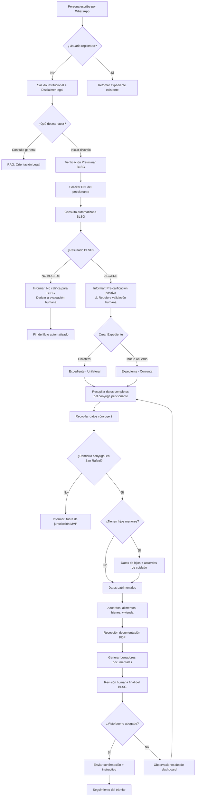
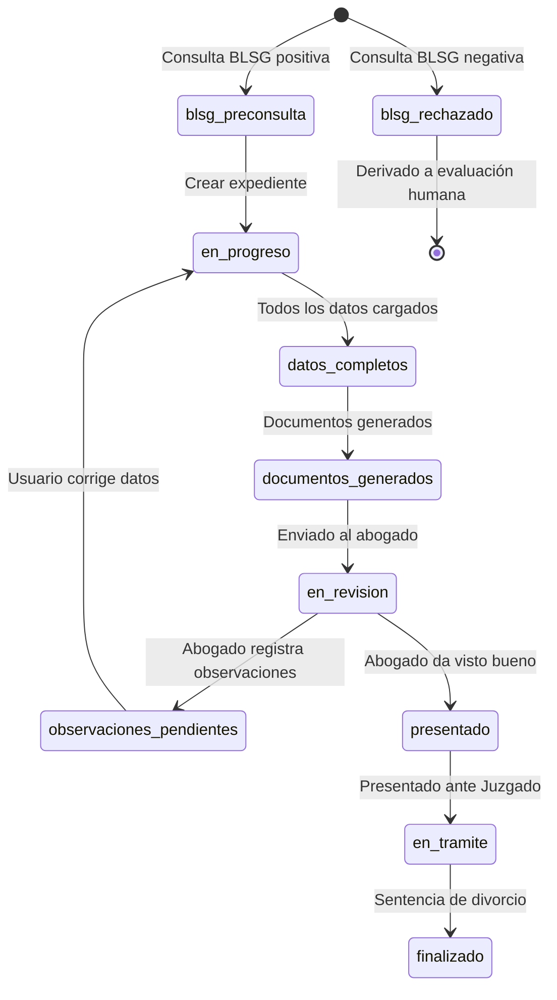

# PRD — LawraBot: Asistente Legal para Divorcios por WhatsApp

> **Estado:** Versión v1.0 — Aprobado para implementación
> **Fecha:** 2026-03-26
> **Autor:** Equipo LawraBot
> **Organismo:** Ministerio Público de la Defensa — Provincia de Mendoza

---

## Tabla de Contenidos

1. [Visión del Producto](#1-visión-del-producto)
2. [Usuarios Objetivo](#2-usuarios-objetivo)
3. [Modalidades de Divorcio](#3-modalidades-de-divorcio)
4. [Alcance Funcional (MVP)](#4-alcance-funcional-mvp)
5. [Flujo Principal del Usuario](#5-flujo-principal-del-usuario)
6. [Jurisdicción del MVP](#6-jurisdicción-del-mvp)
7. [Reglas de Negocio Críticas](#7-reglas-de-negocio-críticas)
8. [Métricas de Éxito (KPIs)](#8-métricas-de-éxito-kpis)
9. [Casos de Uso](#9-casos-de-uso)
10. [Mockups Conversacionales](#10-mockups-conversacionales)
11. [Historias de Usuario](#11-historias-de-usuario)
12. [Requisitos No Funcionales](#12-requisitos-no-funcionales)
13. [Límites del Sistema](#13-límites-del-sistema)
14. [Anexo A: Documentación PDF Requerida](#anexo-a-documentación-pdf-requerida)
15. [Preguntas Resueltas](#15-preguntas-resueltas)

---

## 1. Visión del Producto

LawraBot es un asistente legal automatizado de propiedad del Ministerio Público de la Defensa en Mendoza, Argentina que atiende a personas por **WhatsApp** para guiarlas en el proceso de inicio de **divorcio de mutuo acuerdo o unilateral** en Argentina, como parte del servicio gratuito de la Defensa para personas con escasos recursos económicos que obtengan el Beneficio de Litigar Sin Gastos (BLSG). El bot orienta, recopila datos, y genera borradores del **Convenio Regulador de Efectos del Divorcio** y de la **Demanda de Divorcio**, escritos de mero trámite y otros escritos relacionados con el divorcio, también permite el seguimiento del trámite, todo ello bajo la supervisión humana de un abogado.

### 1.1 Problema que Resuelve

- Las personas que quieren iniciar un divorcio no saben por dónde empezar ni qué datos necesitan.
- Los profesionales del derecho pierden horas en la "toma de datos" inicial (intake) que es repetitiva.
- El acceso a orientación legal básica está limitado por horarios y costos de consulta.
- El seguimiento del trámite es engorroso y poco transparente.
- La tramitación del Beneficio de Litigar Sin Gastos (BLSG) agrega pasos manuales al proceso.

### 1.2 Propuesta de Valor

- **Para el usuario final (cliente):** Acceso inmediato 24/7, guía empática paso a paso, y entrega de borradores documentales sin necesidad de una primera consulta presencial.
- **Para el profesional del derecho:** Automatización del intake, expedientes pre-armados listos para revisar, y reducción del tiempo de elaboración documental.
- **Para el Ministerio Público de la Defensa:** Reducción de la carga de trabajo, mejora de la eficiencia, y mayor alcance del servicio.

---

## 2. Usuarios Objetivo

| Tipo de Usuario | Descripción | Necesidad Principal |
| --------------- | ----------- | ------------------- |
| **Cliente** | Persona que desea iniciar un divorcio de mutuo acuerdo o unilateral | Orientación clara, recopilación guiada de datos, borradores de documentos, seguimiento del trámite |
| **Abogado** | Profesional del derecho que supervisa y firma los documentos | Expedientes completos, borradores listos para revisión, dashboard de casos |
| **Operador/Defensoría** | Personal del MPD que evalúa casos BLSG con criterios específicos | Dashboard para gestión, visibilidad de documentos, canal de observaciones |

---

## 3. Modalidades de Divorcio

### 3.1 Divorcio Unilateral (Petición de uno solo de los cónyuges)

- Iniciado por **un solo cónyuge** que interactúa con el bot.
- No requiere la conformidad ni la participación del otro cónyuge en la carga de datos.
- El cónyuge peticionante carga sus datos y los datos del otro cónyuge que conozca.
- Requiere la elaboración del Convenio Regulador de Efectos del Divorcio.

### 3.2 Divorcio por Petición Conjunta (Mutuo Acuerdo)

- Ambos cónyuges están de acuerdo en el divorcio.
- **Uno de los dos cónyuges será el encargado de interactuar con el bot** en representación de ambos.
- Requiere la elaboración del Convenio Regulador de Efectos del Divorcio.

---

## 4. Alcance Funcional (MVP)

### 4.1 Funcionalidades del MVP

#### F1: Atención Inicial por WhatsApp

- El bot recibe al usuario con un saludo institucional y empático.
- El bot verifica si se trata de un usuario registrado o nuevo.
- Explica brevemente qué puede hacer y qué NO puede hacer (orientación vs. asesoramiento vinculante).
- Pregunta si desea iniciar el proceso de divorcio de mutuo acuerdo o unilateral.

#### F2: Verificación Preliminar BLSG (Filtro Inicial)

- **Paso prioritario:** Antes de crear el expediente, el bot solicita el DNI del peticionante.
- Realiza una **consulta automatizada** al sistema BLSG del Poder Judicial de Mendoza (`https://blsg.pjm.gob.ar/`).
- **Sistema BLSG:** Acceso público, solo requiere ingresar DNI o apellido y nombre. No expone API REST, se automatiza mediante navegador (Playwright).
- **Dos posibles resultados:**
  - **NO ACCEDE:** El bot informa al usuario que no califica según criterios del PJM y ofrece derivación a evaluación humana.
  - **ACCEDE:** El bot informa pre-calificación positiva, aclarando que **requiere validación humana** por criterios específicos de la Defensoría.
- **Economía del proceso:** Si el resultado es negativo, se evita recopilar datos innecesarios.

#### F3: Orientación Legal Básica (RAG)

- El usuario puede hacer preguntas generales sobre el proceso de divorcio.
- El bot busca en una base de conocimiento legal (Código Civil y Comercial, doctrina) y responde en lenguaje accesible.
- **Siempre** aclara que la información es orientativa y que un abogado revisará el caso.

#### F4: Recopilación de Datos del Expediente

- Solo se ejecuta si el BLSG preliminar es ACCEDE.
- El bot guía al usuario a través de un flujo conversacional para recopilar:
  - **Datos personales de los cónyuges:** Nombre completo, DNI, CUIL, domicilio, fecha de nacimiento, género, profesión/oficio.
  - **Datos del matrimonio:** Fecha, lugar, acta de matrimonio.
  - **Hijos menores o con discapacidad:** Nombres, fechas de nacimiento, DNI.
  - **Bienes del matrimonio (régimen patrimonial):** Inmuebles, vehículos, cuentas bancarias.
  - **Acuerdos sobre alimentos, cuidado personal de hijos, régimen de comunicación y división de bienes.**
  - **Último domicilio conyugal:** Se valida que esté ubicado en el Departamento de San Rafael (MVP).
- El bot puede retomar la conversación donde quedó si el usuario se desconecta.

#### F5: Recepción y Lectura de Documentación Digital

- El bot puede **recibir archivos PDF** enviados por el usuario a través de WhatsApp.
- **Catálogo de documentos aceptados:** 9 tipos (ver Anexo A).
- **Validación de PDFs:**
  - Formato válido (header %PDF)
  - Tamaño < 10MB
  - Legibilidad básica (contiene texto extraíble)
- **Si la extracción falla:** Se guarda igual, se marca como "requiere revisión manual" y se notifica al usuario.
- **No se procesan audios ni imágenes** — solo documentos en formato PDF.

#### F6: Beneficio de Litigar Sin Gastos (BLSG) - Revisión Final

- Con los datos completos del expediente, el personal de la Defensoría realiza una **evaluación humana** del BLSG según criterios propios.
- El bot presenta los datos recopilados para facilitar esta evaluación.
- **Normativa aplicable:**
  - Ley Nº 9.658 — Procedimiento Beneficio de Litigar Sin Gastos.
  - Acordada Nº 32.299 — Agilización del proceso de otorgamiento del BLSG.

#### F7: Generación de Borradores Documentales

- **Convenio Regulador:** Genera un borrador Word (.docx) con las cláusulas pactadas por las partes, basado en plantillas judiciales reales.
- **Demanda de Divorcio:** Genera el escrito judicial inicial con los datos recopilados.
- **Ficha BLSG:** Se adjunta la constancia del BLSG descargada del sistema automatizado.
- **Escritos de mero trámite:** Escritos complementarios necesarios para el proceso.
- Los documentos se envían al usuario por WhatsApp como archivo descargable.
- **Las plantillas judiciales** son proporcionadas por el equipo legal y se alojan en `divorce_mcp_server/src/main/resources/templates/legal-templates/`.

#### F8: Gestión de Estado del Expediente y Seguimiento

- Cada conversación genera un "expediente digital" persistente en base de datos.
- El expediente tiene un estado (ver Sección 6.2).
- El bot puede informar al usuario en qué etapa está su caso.

#### F9: Confirmación y Notificación Post-Presentación

- Una vez que el profesional humano da el visto bueno a la documentación:
  - Se envía **confirmación por correo electrónico** (vía cuenta de Gmail, con posibilidad futura de migrar a SMTP institucional) al o los interesados informando que el trámite ha sido presentado ante el Juzgado.
  - El correo incluye un **instructivo para hacer el seguimiento** del trámite mediante el chat de WhatsApp con el agente LawraBot.
- El usuario puede volver a escribir al bot en cualquier momento para consultar el estado de su expediente.

#### F10: Canal de Observaciones del Abogado al Usuario

- El operador humano de la Defensoría tiene visibilidad de los casos a través de un **dashboard**.
- Desde el dashboard, el operador puede enviar mensajes específicos al usuario solicitando información puntual o documentación adicional.
- El usuario responde las observaciones por el mismo canal de WhatsApp; el bot actualiza el expediente con la información corregida.
- El flujo observaciones → corrección → re-revisión puede repetirse hasta que el abogado dé el visto bueno.

### 4.2 Funcionalidades Fuera del MVP (Futuro)

- [ ] Dashboard web para el abogado (ver expedientes, descargar documentos).
- [ ] Integración con sistemas de gestión judicial.
- [ ] Soporte para otros tipos de trámites de familia (alimentos, tenencia, régimen de visitas).
- [ ] Firma digital de documentos.
- [ ] Ampliación a otros departamentos de la Segunda Circunscripción (General Alvear, Malargüe).
- [ ] Ampliación a otras circunscripciones judiciales de Mendoza.
- [ ] Migración del servicio de email de Gmail a SMTP institucional del MPD.

---

## 5. Flujo Principal del Usuario



---

## 6. Jurisdicción del MVP

### 6.1 Alcance Geográfico y Legal

| Aspecto | Detalle |
| --------- | ------- |
| **País** | República Argentina |
| **Provincia** | Mendoza |
| **Circunscripción** | Segunda Circunscripción Judicial |
| **Departamentos cubiertos (futuro)** | San Rafael, General Alvear, Malargüe |
| **Departamento operativo (MVP)** | **San Rafael** (último domicilio conyugal en San Rafael) |
| **Legislación aplicable** | Código Civil y Comercial de la Nación (Ley Nº 26.994) artículos 435 a 442 más artículos conexos sobre alimentos, responsabilidad parental y compensación económica, Ley Nº 9.658 (BLSG), Acordada 32.299, Código Procesal Civil, Comercial y Tributario de Mendoza (Ley 9.001), Código Procesal de Familia y Violencia Familiar (Ley 9120), MATRIMONIO CIVIL (Ley 26.618) |

### 6.2 Estados del Expediente



---

## 7. Reglas de Negocio Críticas

| # | Regla | Descripción |
| --- | ----- | ----------- |
| RN1 | **Sin asesoramiento vinculante** | El bot SIEMPRE debe aclarar que brinda orientación, no asesoramiento legal definitivo. Un abogado humano DEBE revisar y firmar todo documento. |
| RN2 | **Jurisdicción MVP** | Solo se aceptan expedientes donde el **último domicilio conyugal** se encuentre en el **Departamento de San Rafael**, Mendoza. |
| RN3 | **Tipo de divorcio** | El MVP tramita divorcios unilaterales y de mutuo acuerdo (Art. 437 CCyC). |
| RN4 | **Representación conjunta** | En divorcios de mutuo acuerdo, **un solo cónyuge interactúa con el bot** cargando los datos de ambos. |
| RN5 | **BLSG obligatorio** | Al tratarse del Ministerio Público de la Defensa, el trámite del BLSG se incorpora automáticamente a la demanda. |
| RN6 | **Privacidad de datos** | Los datos sensibles (DNI, nombres de menores, patrimonio) deben estar encriptados en reposo y no deben aparecer en logs de texto plano. |
| RN7 | **Retomabilidad** | El usuario puede desconectarse y volver días después sin perder los datos ya proporcionados. |
| RN8 | **Validación documental** | Todo documento generado DEBE pasar por revisión humana antes de ser presentado ante el juzgado. |
| RN9 | **Confirmación post-presentación** | Una vez presentada la demanda, se envía un correo electrónico de confirmación al interesado con instrucciones de seguimiento vía WhatsApp. |
| RN10 | **Solo texto y PDF** | El bot procesa mensajes de texto y archivos PDF. No se implementa Speech-to-Text ni procesamiento de imágenes en el MVP. |
| RN11 | **Ciclo de observaciones** | El abogado puede devolver observaciones al usuario a través del bot desde el dashboard. El expediente no avanza hasta que las observaciones sean resueltas. |
| RN12 | **BLSG en dos fases** | La consulta automatizada al BLSG del PJM es un filtro inicial. La aceptación definitiva requiere evaluación humana con criterios de la Defensoría. |
| RN13 | **Limitación BLSG consultas** | El sistema reintenta la consulta BLSG máximo 3 veces ante fallos técnicos antes de derivar a atención humana. |

---

## 8. Métricas de Éxito (KPIs)

| Métrica | Objetivo MVP |
| ------- | ------------ |
| Tiempo promedio de recopilación de datos | < 30 minutos de conversación activa |
| Tasa de finalización del flujo | > 60% de los usuarios que inician completan la carga de datos |
| Satisfacción del usuario (encuesta post-proceso) | > 4/5 |
| Reducción de tiempo de intake para el abogado | > 70% vs. intake manual |
| Tasa de éxito en consulta automática BLSG | > 90% de consultas resueltas sin intervención manual |
| Tiempo de respuesta del bot | < 3 segundos en 95% de interacciones |

---

## 9. Casos de Uso

### CU1: Flujo Exitoso - Divorcio por Mutuo Acuerdo

**Actor Principal:** Cliente (uno de los cónyuges)
**Precondición:** Usuario no registrado, escribe por WhatsApp

| Paso | Actor | Sistema |
|------|-------|---------|
| 1 | Escribe "Hola, quiero divorciarme" | Saluda, explica servicio, pide DNI para verificación BLSG |
| 2 | Proporciona DNI | Consulta BLSG, resultado "ACCEDE" |
| 3 | | Informa pre-calificación positiva, crea expediente |
| 4 | | Solicita datos del cónyuge 1 (peticionante) |
| 5 | Completa datos | Solicita datos del cónyuge 2 |
| 6 | Completa datos | Pregunta por hijos menores |
| 7 | Indica "Sí, 2 hijos" | Solicita datos de cada hijo |
| 8 | Completa | Pregunta por bienes |
| 9 | Lista bienes | Solicita documentación PDF |
| 10 | Envía 3 PDFs | Valida y extrae información |
| 11 | | Genera borradores, notifica abogado |
| 12 | | Abogado revisa, aprueba |
| 13 | | Envía email confirmación + instructivo |
| 14 | | Estado: presentado |

**Postcondición:** Expediente en estado "presentado", email enviado

### CU2: Flujo Exitoso - Divorcio Unilateral

Similar a CU1, pero:
- Un solo cónyuge interactúa
- El cónyuge 2 no participa en la conversación
- Se recopilan los datos que el peticionante conoce del cónyuge 2

### CU3: BLSG Negativo - Rechazo Temprano

| Paso | Actor | Sistema |
|------|-------|---------|
| 1 | Escribe "Quiero iniciar divorcio" | Saluda, pide DNI |
| 2 | Proporciona DNI | Consulta BLSG |
| 3 | | Resultado: "NO ACCEDE" |
| 4 | | Informa que no califica para BLSG según criterios del PJM |
| 5 | | Ofrece derivación a evaluación humana |
| 6 | Acepta derivación | Registra contacto para abogado |
| 7 | | Fin del flujo automatizado |

**Postcondición:** No se crea expediente, caso derivado a atención humana

### CU4: Ciclo de Observaciones

| Paso | Actor | Sistema |
|------|-------|---------|
| 1 | | Documentos generados, estado: en_revision |
| 2 | Abogado revisa vía dashboard | Detecta: falta fecha exacta de matrimonio |
| 3 | Abogado registra observación desde dashboard | Estado: observaciones_pendientes |
| 4 | | Bot notifica usuario: "Falta la fecha exacta..." |
| 5 | Usuario responde | Actualiza expediente |
| 6 | | Estado: en_revision |
| 7 | Abogado revisa | Aprueba |
| 8 | | Continúa flujo normal |

---

## 10. Mockups Conversacionales

### M1: Saludo Inicial y Verificación BLSG

```
👤 Usuario: Hola, quiero divorciarme

🤖 LawraBot: ¡Hola! Soy LawraBot, el asistente legal del Ministerio
Público de la Defensa de Mendoza.

Puedo ayudarte a iniciar el trámite de divorcio de mutuo acuerdo o
unilateral. Antes de comenzar, necesito verificar si accedes al
Beneficio de Litigar Sin Gastos (BLSG).

Por favor, envíame tu número de DNI para realizar la consulta.
⚠️ *Nota: Esta es orientación inicial, no asesoramiento vinculante.*

👤 Usuario: 30123456

🤖 LawraBot: ✅ ¡Buenas noticias! Según la consulta preliminar al
sistema del Poder Judicial, accedes al BLSG.

*Importante: Esta consulta inicial es positiva, pero requiere
validación humana por parte de la Defensoría según sus criterios
específicos.*

¿Deseas continuar con el trámite?
- 1️⃣ Divorcio por mutuo acuerdo
- 2️⃣ Divorcio unilateral
```

### M2: Consulta BLSG Negativa

```
🤖 LawraBot: Según la consulta al sistema del Poder Judicial, según
los criterios generales NO accederías al BLSG.

Esto puede deberse a:
- Ingresos superiores al límite establecido
- Titularidad de bienes que exceden los montos permitidos

Sin embargo, la Defensoría tiene criterios adicionales que pueden
evaluar tu situación particular. ¿Deseas que un abogado de la
Defensoría revise tu caso manualmente?

- 1️⃣ Sí, quiero que me contacten
- 2️⃣ No, gracias
```

### M3: Solicitud de Documentación PDF

```
🤖 LawraBot: Perfecto, ahora necesito que me envíes la documentación
de respaldo. Por favor, envía UN DOCUMENTO A LA VEZ como archivo PDF.

Necesito los siguientes documentos:
📋 1. Acta de matrimonio (emitida en el último mes)
🪪 2. DNI (frente y dorso) - tuyo y de tu cónyuge
📄 3. Constancia de CUIL
💰 4. Recibo de sueldo o comprobante de ingresos
🏛️ 5. Certificado negativo de aportes de ANSES

Si tienes hijos menores, también necesitaré:
👶 6. Acta de nacimiento de cada hijo

Si se pretende división de bienes:
🏠 7. Documentación de bienes (escrituras, boletos, etc.)

¿Tienes alguna de estas documentos lista para enviar? Responde con
el número o escribe "continuar sin documentos".
```

### M4: Confirmación de PDF Recibido

```
👤 Usuario: [envía PDF del DNI]

🤖 LawraBot: ✅ ¡Recibí tu documento!

Tipo detectado: DNI (frente y dorso)
Estado: ✅ Legible y válido

He extraído la siguiente información:
- Nombre: María González
- DNI: 30.123.456
- Fecha de nacimiento: 15/03/1985

¿Es correcta esta información?
- 1️⃣ Sí, es correcto
- 2️⃣ No, hay errores
```

---

## 11. Historias de Usuario

| ID | Como... | Quiero... | Para que... | Prioridad |
|----|---------|-----------|-------------|-----------|
| HU1 | Cliente | Verificar mi acceso al BLSG antes de cargar todos mis datos | No perder tiempo si no califico | Must |
| HU2 | Cliente | Cargar los datos de mi divorcio conversando por WhatsApp | No tener que ir presencialmente a la Defensoría | Must |
| HU3 | Cliente | Enviar mis documentos en PDF directamente al bot | Evitar trámites presenciales de presentación de papeles | Must |
| HU4 | Cliente | Recibir los borradores de documentos por WhatsApp | Revisarlos antes de la presentación | Must |
| HU5 | Cliente | Recibir confirmación por email cuando se presente mi caso | Tener un comprobante del trámite | Should |
| HU6 | Abogado | Ver los expedientes pendientes de revisión en un dashboard | Gestionar mi trabajo eficientemente | Should |
| HU7 | Abogado | Enviar observaciones al usuario sobre documentos incompletos | Asegurar la calidad de los expedientes | Must |
| HU8 | Cliente | Consultar el estado de mi expediente en cualquier momento | Tener tranquilidad sobre el trámite | Should |
| HU9 | Cliente | Retomar mi trámite días después sin perder datos | Completarlo a mi ritmo | Must |
| HU10 | Abogado | Descargar todos los documentos de un expediente | Presentarlos ante el juzgado | Must |

---

## 12. Requisitos No Funcionales

### Seguridad

| RNF | Descripción | Criterio de Aceptación |
|-----|-------------|------------------------|
| RNF-S01 | Encriptación de PII | Datos sensibles (DNI, nombres de menores) encriptados en reposo con AES-256 |
| RNF-S02 | Sanitización de logs | Logs nunca contienen datos personales en texto plano |
| RNF-S03 | Autenticación MCP | Servidor MCP solo acepta conexiones de IPs autorizadas |
| RNF-S04 | Seguridad WhatsApp | Validar número de teléfono como identificador único |

### Disponibilidad y Performance

| RNF | Descripción | Criterio de Aceptación |
|-----|-------------|------------------------|
| RNF-D01 | Uptime | Sistema disponible 99.5% del tiempo (excluyendo mantenimiento programado) |
| RNF-P01 | Tiempo de respuesta | Respuesta del bot < 3 segundos en 95% de interacciones |
| RNF-P02 | Consulta BLSG | Timeout de 30s, con reintentos automáticos (máx 3) |
| RNF-P03 | Procesamiento PDF | Archivos hasta 10MB procesados en < 10s |

### Escalabilidad

| RNF | Descripción | Criterio de Aceptación |
|-----|-------------|------------------------|
| RNF-E01 | Concurrentes | Soporte para 50 conversaciones simultáneas |
| RNF-E02 | Almacenamiento | Capacidad para 10,000 expedientes en BD |

---

## 13. Límites del Sistema (Anti-requisitos)

El sistema **NO** está diseñado para:

| # | Limitación | Justificación | Alternativa |
|---|------------|---------------|-------------|
| L1 | Divorcios contenciosos | Requieren proceso judicial complejo con audiencias | Derivación a abogado |
| L2 | Procesamiento de audios | No hay Speech-to-Text en MVP | El usuario debe escribir |
| L3 | Procesamiento de imágenes (fotos) | Solo se aceptan PDFs | Convertir a PDF antes de enviar |
| L4 | Firma digital de documentos | Requiere infraestructura de firma electrónica | Firma presencial ante escribano |
| L5 | Jurisdicción fuera de San Rafael | MVP limitado geográficamente | Expansión futura v1.1+ |
| L6 | Modificación de documentos ya presentados | Una vez en trámite judicial, el sistema no interviene | Seguimiento por vía judicial tradicional |

---

## Anexo A: Documentación PDF Requerida

### A.1 Catálogo de Documentos

| # | Tipo de Documento | Obligatorio | Especificaciones | Validación |
|---|-------------------|-------------|------------------|------------|
| 1 | **Acta de Matrimonio** | Sí | Fecha de emisión ≤ 1 mes | Formato, vigencia |
| 2 | **DNI (Frente y Dorso)** | Sí | Ambas caras del peticionante y cónyuge | Legibilidad, número visible |
| 3 | **Constancia de CUIL** | Sí | Emitida por ANSES o similar | Formato oficial |
| 4 | **Recibo de Sueldo / Ingreso Declarado** | Sí | Últimos 3 meses preferentemente | Monto legible |
| 5 | **Certificado Negativo de Aportes (ANSES)** | Sí | Sin aportes recientes | Fecha de emisión |
| 6 | **Acta de Nacimiento de Hijos** | Condicional | Si hay hijos menores o con discapacidad | Coincidencia de nombres |
| 7 | **Convenio Régimen Responsabilidad Parental** | Condicional | Solo si existe previo | Fecha, partes firmantes |
| 8 | **Documentación de Bienes** | Condicional | Si se pretende división de bienes | Ver A.2 |
| 9 | **Constancia BLSG** | Automático | Generada por el sistema | N/A (del sistema PJM) |

### A.2 Subcategorías: Documentación de Bienes

| Bien | Documento Requerido |
|------|----------------------|
| Inmueble | Escritura pública |
| Inmueble (en trámite) | Boleto de compraventa |
| Vehículo | Tarjeta de identificación de vehículo |
| Cuenta bancaria | Extracto bancario |

### A.3 Proceso de Validación de PDFs

```
USUARIO ENVÍA PDF
        ↓
┌───────────────────┐
│ 1. Validación     │
│    Técnica        │
│ - Header %PDF     │
│ - Tamaño < 10MB   │
│ - No corrupto     │
└─────────┬─────────┘
          ↓
    ┌─────┴─────┐
   FAIL        OK
    ↓           ↓
Guardar +     ┌─────────────────┐
Marcar        │ 2. Extracción   │
"revisión     │    de Texto     │
 manual"      │ - OCR si es     │
Notificar     │   escaneado     │
usuario       │ - Verificar     │
              │   legibilidad   │
              └────────┬────────┘
                       ↓
               ┌───────┴───────┐
              FAIL           OK
               ↓               ↓
         Guardar +        Autocompletar
         Marcar            campos del
         "revisión         expediente
         manual"
         Notificar
         usuario:
         "PDF recibido,
          calidad limitada"
```

### A.4 Mensajes al Usuario según Validación

| Situación | Mensaje del Bot |
|-----------|-----------------|
| PDF válido y legible | "✅ Recibí tu documento. He extraído la información correctamente." |
| PDF escaneado baja calidad | "⚠️ Recibí tu documento. Como es un escaneado, lo guardaré pero un operador deberá revisarlo manualmente." |
| PDF corrupto/ilegible | "❌ No pude leer el documento. Por favor, intenta enviarlo de nuevo con mejor calidad." |
| Formato incorrecto | "❌ El archivo no parece ser un PDF válido. Por favor, envía el documento en formato PDF." |
| Tamaño excedido (>10MB) | "❌ El archivo es demasiado grande (máximo 10MB). Intenta comprimirlo o enviar una versión de menor calidad." |

---

## 15. Preguntas Resueltas

### 15.1 Resueltas

- [x] ~~¿El bot atenderá a ambos cónyuges por separado o a uno solo que carga los datos de ambos?~~ → Uno solo carga los datos de ambos.
- [x] ~~¿Qué modelos de Word/plantillas judiciales usaremos como base?~~ → Proporcionados por el equipo legal, en `/templates/legal-templates/`.
- [x] ~~¿Necesitamos un mecanismo para que el abogado devuelva observaciones al usuario a través del bot?~~ → Sí. El operador envía observaciones desde un dashboard.
- [x] ~~¿El bot debe poder manejar audios de WhatsApp?~~ → No, solo texto y PDFs.
- [x] ~~¿Qué jurisdicción específica será la primera?~~ → Segunda Circunscripción, Departamento de San Rafael, Mendoza.
- [x] ~~¿El sistema BLSG expone una API pública?~~ → No. Se requiere automatización de navegador (browser automation) para consultar `blsg.pjm.gob.ar`.
- [x] ~~¿Qué servicio de email se usará?~~ → Gmail inicialmente, con posibilidad futura de migrar a SMTP institucional del MPD.
- [x] ~~¿El bot debe solicitar documentación digitalizada al usuario?~~ → Sí, el bot recibe y procesa archivos PDF enviados por los usuarios.
- [x] ~~¿Se necesitan credenciales específicas del Poder Judicial para acceder al sistema BLSG, o el acceso es público?~~ → El sistema de consulta es de acceso público, solo se necesita cargar DNI o apellido y nombre. La consulta es filtro inicial; la aceptación definitiva requiere evaluación humana.
- [x] ~~¿Cómo registra el abogado sus observaciones?~~ → El operador humano tiene visibilidad a través de un dashboard para gestionar casos y enviar mensajes específicos al usuario.
- [x] ~~¿Cuáles son los tipos de PDF que el usuario podría enviar?~~ → 9 tipos documentales: Acta de matrimonio, DNI, Constancia de CUIL, Recibo de sueldo, Certificado negativo ANSES, Actas de nacimiento de hijos, Convenio previo, Documentación de bienes, Constancia BLSG (ver Anexo A).
- [x] ~~¿El bot debe validar el formato y legibilidad del PDF antes de procesarlo?~~ → Sí: validar formato (header %PDF), tamaño (<10MB), legibilidad básica (texto extraíble). Si falla extracción: guardar igual + marcar como "requiere revisión manual" + notificar usuario.

---

> **Documento aprobado para implementación.**
>
> **Próximo paso:** Alinear TechSpecs.md con los cambios del PRD v1.0, luego comenzar la Fase 1 de implementación (Fundamentos MCP).
