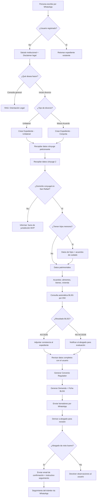

# PRD — LawraBot: Asistente Legal para Divorcios por WhatsApp

> **Estado:** Borrador v0.3 — En iteración  
> **Fecha:** 2026-03-24  
> **Autor:** Equipo LawraBot  
> **Organismo:** Ministerio Público de la Defensa — Provincia de Mendoza

---

## 1. Visión del Producto

LawraBot es un asistente legal automatizado de propiedad del Ministerio Público de la Defensa en Mendoza, Argentina que atiende a personas por **WhatsApp** para guiarlas en el proceso de inicio de **divorcio de mutuo acuerdo o unilateral** en Argentina, como parte del servicio gratuito de la Defensa para personas con escasos recursos económicos que obtengan el Beneficio de Litigar Sin Gastos (BLSG). El bot orienta, recopila datos, y genera borradores del **Convenio Regulador de Efectos del Divorcio** y de la **Demanda de Divorcio**, escritos de mero trámite y otros escritos relacionados con el divorcio, también permite el seguimiento del trámite, todo ello bajo la supervisión humana de un abogado.

### 1.1 Problema que Resuelve

- Las personas que quieren iniciar un divorcio no saben por dónde empezar ni qué datos necesitan.
- Los profesionales del derecho pierden horas en la "toma de datos" inicial (intake) que es repetitiva.
- El acceso a orientación legal básica está limitado por horarios y costos de consulta.
- El seguimiento del trámite es engorroso y poco transparente.
- La tramitación del Beneficio de Litigar Sin Gastos (BLSG) agrega pasos manuales al proceso.

### 1.2 Propuesta de Valor

- **Para el usuario final (cliente):** Acceso inmediato 24/7, guía empática paso a paso, y entrega de borradores documentales sin necesidad de una primera consulta presencial.
- **Para el profesional del derecho:** Automatización del intake, expedientes pre-armados listos para revisar, y reducción del tiempo de elaboración documental.
- **Para el Ministerio Público de la Defensa:** Reducción de la carga de trabajo, mejora de la eficiencia, y mayor alcance del servicio.

---

## 2. Usuarios Objetivo

| Tipo de Usuario | Descripción                                                         | Necesidad Principal                                                                                |
| --------------- | ------------------------------------------------------------------- | -------------------------------------------------------------------------------------------------- |
| **Cliente**     | Persona que desea iniciar un divorcio de mutuo acuerdo o unilateral | Orientación clara, recopilación guiada de datos, borradores de documentos, seguimiento del trámite |
| **Abogado**     | Profesional del derecho que supervisa y firma los documentos        | Expedientes completos, borradores listos para revisión, dashboard de casos                         |

---

## 3. Modalidades de Divorcio

### 3.1 Divorcio Unilateral (Petición de uno solo de los cónyuges)

- Iniciado por **un solo cónyuge** que interactúa con el bot.
- No requiere la conformidad ni la participación del otro cónyuge en la carga de datos.
- El cónyuge peticionante carga sus datos y los datos del otro cónyuge que conozca.
- Requiere la elaboración del Convenio Regulador de Efectos del Divorcio.

### 3.2 Divorcio por Petición Conjunta (Mutuo Acuerdo)

- Ambos cónyuges están de acuerdo en el divorcio.
- **Uno de los dos cónyuges será el encargado de interactuar con el bot** en representación de ambos.
- Requiere la elaboración del Convenio Regulador de Efectos del Divorcio.

---

## 4. Alcance Funcional (MVP)

### 4.1 Funcionalidades del MVP

#### F1: Atención Inicial por WhatsApp

- El bot recibe al usuario con un saludo institucional y empático.
- El bot verifica si se trata de un usuario registrado o nuevo.
- Explica brevemente qué puede hacer y qué NO puede hacer (orientación vs. asesoramiento vinculante).
- Pregunta si desea iniciar el proceso de divorcio de mutuo acuerdo o unilateral.

#### F2: Orientación Legal Básica (RAG)

- El usuario puede hacer preguntas generales sobre el proceso de divorcio.
- El bot busca en una base de conocimiento legal (Código Civil y Comercial, doctrina) y responde en lenguaje accesible.
- **Siempre** aclara que la información es orientativa y que un abogado revisará el caso.

#### F3: Recopilación de Datos del Expediente

- El bot guía al usuario a través de un flujo conversacional para recopilar:
  - **Datos personales de los cónyuges:** Nombre completo, DNI, CUIL, domicilio, fecha de nacimiento, género, profesión/oficio.
  - **Datos del matrimonio:** Fecha, lugar, acta de matrimonio.
  - **Hijos menores o con discapacidad:** Nombres, fechas de nacimiento, DNI.
  - **Bienes del matrimonio (régimen patrimonial):** Inmuebles, vehículos, cuentas bancarias.
  - **Acuerdos sobre alimentos, cuidado personal de hijos, régimen de comunicación y división de bienes.**
  - **Último domicilio conyugal:** Se valida que esté ubicado en el Departamento de San Rafael (MVP).
- El bot puede retomar la conversación donde quedó si el usuario se desconecta.

#### F3.5: Recepción y Lectura de Documentación Digital

- El bot puede **recibir archivos PDF** enviados por el usuario a través de WhatsApp (ej: acta de matrimonio, partidas de nacimiento, escrituras, recibos de sueldo).
- El sistema **extrae y procesa el contenido** de los PDFs recibidos para:
  - Validar la información previamente cargada por el usuario.
  - Autocompletar campos faltantes del expediente.
  - Almacenar los documentos originales como respaldo digital del expediente.
- **No se procesan audios ni imágenes** — solo documentos en formato PDF.

#### F4: Beneficio de Litigar Sin Gastos (BLSG)

- Al tratarse de usuarios del Ministerio Público de la Defensa (personas de escasos recursos), **el trámite del BLSG se incorpora de manera conjunta** a la presentación de la demanda de divorcio.
- El bot, con los datos del/los peticionante/s (DNI, CUIL, nombre, apellido, fecha de nacimiento, género), realiza una **consulta automatizada** al sistema BLSG del Poder Judicial de Mendoza (`https://blsg.pjm.gob.ar/`) para descargar la constancia correspondiente.
- **Nota técnica:** El sistema BLSG no expone una API REST. La consulta se automatiza mediante **automatización de navegador** (browser automation / web scraping), buscando por DNI o nombre y apellido.
- El sistema BLSG emite una constancia PDF con las leyendas **"ACCEDE"** o **"NO PODRÍA ACCEDER"**.
- Si la constancia indica "ACCEDE", se adjunta automáticamente a la demanda de divorcio.
- Si la constancia indica "NO PODRÍA ACCEDER", el bot informa al usuario y al abogado para evaluar si corresponde iniciar el Procedimiento por Incidente de BLSG.
- **Normativa aplicable:**
  - Ley Nº 9.658 — Procedimiento Beneficio de Litigar Sin Gastos.
  - Acordada Nº 32.299 — Agilización del proceso de otorgamiento del BLSG.

#### F5: Generación de Borradores Documentales

- **Convenio Regulador:** Genera un borrador Word (.docx) con las cláusulas pactadas por las partes, basado en plantillas judiciales reales.
- **Demanda de Divorcio:** Genera el escrito judicial inicial con los datos recopilados.
- **Ficha BLSG:** Se adjunta la constancia del BLSG descargada del sistema automatizado.
- **Escritos de mero trámite:** Escritos complementarios necesarios para el proceso.
- Los documentos se envían al usuario por WhatsApp como archivo descargable.
- **Las plantillas judiciales** son proporcionadas por el equipo legal y se alojan en `divorce_mcp_server/src/main/resources/templates/legal-templates/`.

#### F6: Gestión de Estado del Expediente y Seguimiento

- Cada conversación genera un "expediente digital" persistente en base de datos.
- El expediente tiene un estado (en_progreso, datos_completos, documentos_generados, en_revision, presentado, en_tramite).
- El bot puede informar al usuario en qué etapa está su caso.

#### F7: Confirmación y Notificación Post-Presentación

- Una vez que el profesional humano da el visto bueno a la documentación:
  - Se envía **confirmación por correo electrónico** (vía cuenta de Gmail, con posibilidad futura de migrar a SMTP institucional) al o los interesados informando que el trámite ha sido presentado ante el Juzgado.
  - El correo incluye un **instructivo para hacer el seguimiento** del trámite mediante el chat de WhatsApp con el agente LawraBot.
- El usuario puede volver a escribir al bot en cualquier momento para consultar el estado de su expediente.

#### F8: Canal de Observaciones del Abogado al Usuario

- El abogado que revisa el expediente puede **registrar observaciones** sobre los documentos o datos cargados.
- Las observaciones se transmiten automáticamente al usuario **a través del bot de WhatsApp**, quien le indica qué debe corregir, completar o aclarar.
- El usuario responde las observaciones por el mismo canal de WhatsApp; el bot actualiza el expediente con la información corregida.
- El flujo observaciones → corrección → re-revisión puede repetirse hasta que el abogado dé el visto bueno.
- Ejemplos de observaciones típicas:
  - "Falta la fecha exacta de celebración del matrimonio."
  - "El acuerdo de alimentos no especifica un monto. Por favor indique el monto mensual acordado."
  - "Necesitamos que envíe por PDF la partida de nacimiento del hijo menor."

### 4.2 Funcionalidades Fuera del MVP (Futuro)

- [ ] Dashboard web para el abogado (ver expedientes, descargar documentos).
- [ ] Integración con sistemas de gestión judicial.
- [ ] Soporte para otros tipos de trámites de familia (alimentos, tenencia, régimen de visitas).
- [ ] Firma digital de documentos.
- [ ] Ampliación a otros departamentos de la Segunda Circunscripción (General Alvear, Malargüe).
- [ ] Ampliación a otras circunscripciones judiciales de Mendoza.
- [ ] Migración del servicio de email de Gmail a SMTP institucional del MPD.

---

## 5. Flujo Principal del Usuario

---

## 6. Jurisdicción del MVP

| Aspecto                              | Detalle                                                                                                                                                                                                                                                                                                                                                                       |
| ------------------------------------ | ----------------------------------------------------------------------------------------------------------------------------------------------------------------------------------------------------------------------------------------------------------------------------------------------------------------------------------------------------------------------------- |
| **País**                             | República Argentina                                                                                                                                                                                                                                                                                                                                                           |
| **Provincia**                        | Mendoza                                                                                                                                                                                                                                                                                                                                                                       |
| **Circunscripción**                  | Segunda Circunscripción Judicial                                                                                                                                                                                                                                                                                                                                              |
| **Departamentos cubiertos (futuro)** | San Rafael, General Alvear, Malargüe                                                                                                                                                                                                                                                                                                                                          |
| **Departamento operativo (MVP)**     | **San Rafael** (último domicilio conyugal en San Rafael)                                                                                                                                                                                                                                                                                                                      |
| **Legislación aplicable**            | Código Civil y Comercial de la Nación (Ley Nº 26.994) artículos 435 a 442 más los artículos conexos sobre alimentos, responsabilidad parental y compensación económica, Ley Nº 9.658 (BLSG), Acordada 32.299, Código Procesal Civil, Comercial y Tributario de Mendoza (Ley 9.001), Código Procesal de Familia y Violencia Familiar (Ley 9120), MATRIMONIO CIVIL (Ley 26.618) |

---

## 7. Reglas de Negocio Críticas

| #    | Regla                              | Descripción                                                                                                                                    |
| ---- | ---------------------------------- | ---------------------------------------------------------------------------------------------------------------------------------------------- |
| RN1  | **Sin asesoramiento vinculante**   | El bot SIEMPRE debe aclarar que brinda orientación, no asesoramiento legal definitivo. Un abogado humano DEBE revisar y firmar todo documento. |
| RN2  | **Jurisdicción MVP**               | Solo se aceptan expedientes donde el **último domicilio conyugal** se encuentre en el **Departamento de San Rafael**, Mendoza.                 |
| RN3  | **Tipo de divorcio**               | El MVP tramita divorcios unilaterales y de mutuo acuerdo (Art. 437 CCyC).                                                                      |
| RN4  | **Representación conjunta**        | En divorcios de mutuo acuerdo, **un solo cónyuge interactúa con el bot** cargando los datos de ambos.                                          |
| RN5  | **BLSG obligatorio**               | Al tratarse del Ministerio Público de la Defensa, el trámite del BLSG se incorpora automáticamente a la demanda.                               |
| RN6  | **Privacidad de datos**            | Los datos sensibles (DNI, nombres de menores, patrimonio) deben estar encriptados en reposo y no deben aparecer en logs de texto plano.        |
| RN7  | **Retomabilidad**                  | El usuario puede desconectarse y volver días después sin perder los datos ya proporcionados.                                                   |
| RN8  | **Validación documental**          | Todo documento generado DEBE pasar por revisión humana antes de ser presentado ante el juzgado.                                                |
| RN9  | **Confirmación post-presentación** | Una vez presentada la demanda, se envía un correo electrónico de confirmación al interesado con instrucciones de seguimiento vía WhatsApp.     |
| RN10 | **Solo texto y PDF**               | El bot procesa mensajes de texto y archivos PDF. No se implementa Speech-to-Text ni procesamiento de imágenes en el MVP.                        |
| RN11 | **Ciclo de observaciones**         | El abogado puede devolver observaciones al usuario a través del bot. El expediente no avanza hasta que las observaciones sean resueltas.          |

---

## 8. Métricas de Éxito (KPIs)

| Métrica                                          | Objetivo MVP                                                  |
| ------------------------------------------------ | ------------------------------------------------------------- |
| Tiempo promedio de recopilación de datos         | < 30 minutos de conversación activa                           |
| Tasa de finalización del flujo                   | > 60% de los usuarios que inician completan la carga de datos |
| Satisfacción del usuario (encuesta post-proceso) | > 4/5                                                         |
| Reducción de tiempo de intake para el abogado    | > 70% vs. intake manual                                       |
| Tasa de éxito en consulta automática BLSG        | > 90% de consultas resueltas sin intervención manual          |

---

## 9. Preguntas Resueltas y Abiertas

### Resueltas

- [x] ~~¿El bot atenderá a ambos cónyuges por separado o a uno solo que carga los datos de ambos?~~ → Uno solo carga los datos de ambos.
- [x] ~~¿Qué modelos de Word/plantillas judiciales usaremos como base?~~ → Proporcionados por el equipo legal, en `/templates/legal-templates/`.
- [x] ~~¿Necesitamos un mecanismo para que el abogado devuelva observaciones al usuario a través del bot?~~ → Sí. El abogado registra observaciones y el bot las transmite al usuario por WhatsApp (ver F8).
- [x] ~~¿El bot debe poder manejar audios de WhatsApp?~~ → No, solo texto y PDFs.
- [x] ~~¿Qué jurisdicción específica será la primera?~~ → Segunda Circunscripción, Departamento de San Rafael, Mendoza.
- [x] ~~¿El sistema BLSG expone una API pública?~~ → No. Se requiere automatización de navegador (browser automation) para consultar `blsg.pjm.gob.ar`.
- [x] ~~¿Qué servicio de email se usará?~~ → Gmail inicialmente, con posibilidad futura de migrar a SMTP institucional del MPD.
- [x] ~~¿El bot debe solicitar documentación digitalizada al usuario?~~ → Sí, el bot recibe y procesa archivos PDF enviados por los usuarios.

### Abiertas

- [ ] ¿Se necesitan credenciales específicas del Poder Judicial para acceder al sistema BLSG, o el acceso es público?
- [ ] ¿Cómo registra el abogado sus observaciones? (¿A través de un canal dedicado en WhatsApp, un email, o un futuro dashboard?)
- [ ] ¿Cuáles son los tipos de PDF que el usuario podría enviar? (acta de matrimonio, partidas de nacimiento, recibos de sueldo, escrituras, otros)
- [ ] ¿El bot debe validar el formato y legibilidad del PDF antes de procesarlo?

---

> **Próximo paso:** Iterar este documento con el equipo hasta llegar a la versión v1.0, luego alinear TechSpecs.md.
