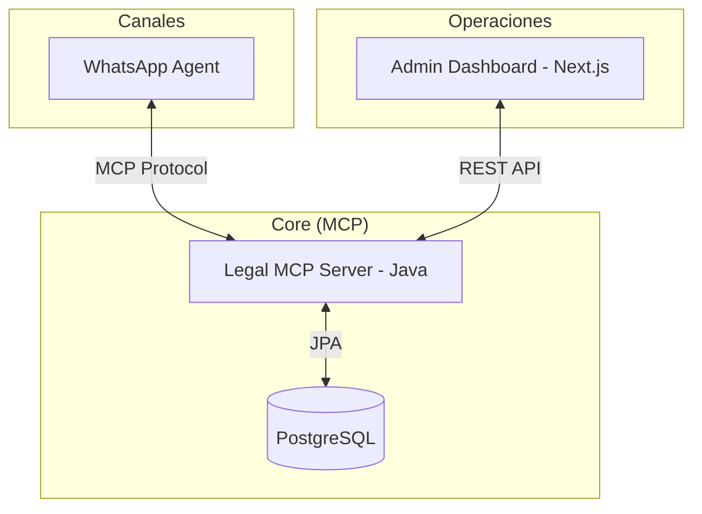

# TechSpecs — LawraBot: Especificaciones Técnicas

> **Estado:** v1.0 — Mayo 2026
> **Depende de:** [PRD.md](./PRD.md)

---

## 1. Arquitectura General (HITL Workflow)

LawraBot integra una IA proactiva con un Centro de Operaciones para el Operador Humano (Human-in-the-Loop).

---

## 2. Componentes del Sistema

### 2.1 Agente de Recolección (WhatsApp)
- **Fase 1 (Pre-consulta)**: Scraping automático del BLSG.
- **Fase 2 (Identidad)**: Solicitud de DNI (frente/dorso).
- **Fase 3 (Socio-Económico)**: Solicitud de comprobantes de ingresos.
- **Fase 4 (Estado Civil)**: Solicitud de Acta de Matrimonio, Nacimiento y CUD.

### 2.2 Centro de Operaciones (Admin Dashboard)
- **Dashboard v2**: Interfaz premium con modo oscuro, Framer Motion y Phosphor Icons.
- **Sujetos e Hijos**: Validación de identidad y vínculo oficial de actas de nacimiento.
- **Pestaña Matrimonio**: 
    - Selección de acta oficial de la galería de evidencias.
    - Validación de antigüedad (alerta > 6 meses).
    - Carga de datos registrales (Tomo, Folio, Acta, Oficina).
    - Utilidades de clonación de domicilio para competencia territorial.

---

## 3. API & Protocolos

### 3.1 Herramientas MCP Actualizadas

| Tool Name | Parámetros Actualizados | Propósito |
|---|---|---|
| `registrar_datos_matrimonio` | `id, fecha, lugar, id_acta, fecha_emision_acta` | Persistencia de datos técnicos del acta |
| `submit_digital_evidence` | `file_base64, document_type, task_id?` | El bot puede subir archivos sin necesidad de una tarea previa |

### 3.2 Endpoints REST (Dashboard)

| Endpoint | Método | Descripción |
|---|---|---|
| `/api/divorce/cases` | GET | Listado de expedientes activos |
| `/api/divorce/cases/{id}` | PUT | Actualización consolidada (HITL) |
| `/api/divorce/evidence/download/{id}` | GET | Descarga de evidencias digitales |

---

## 4. Modelo de Datos (Extendido)

### 4.1 Entidad Expediente
- `marriage_certificate_id`: UUID que apunta al archivo oficial.
- `marriage_certificate_issuance_date`: Fecha de expedición (para control de caducidad).
- `marriage_registry_*`: Campos para Libro, Folio, Acta y Oficina.

### 4.2 Value Objects (Refactorización)
- Se ha eliminado Lombok de los Value Objects críticos (ej: `CuilVO`) para asegurar compatibilidad con el compilador en el entorno de build del servidor.

---

## 5. Seguridad y Privacidad
- **Fresh Start**: Script `cleanup_session.ps1` para purga total de datos de prueba.
- **HITL**: Los datos solo se consideran "Consolidados" tras la revisión humana en el Dashboard.
