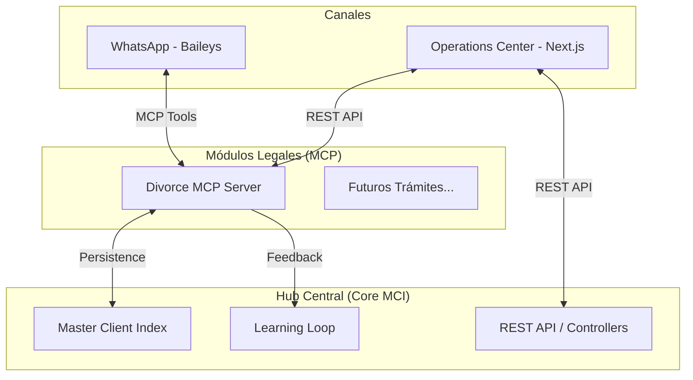
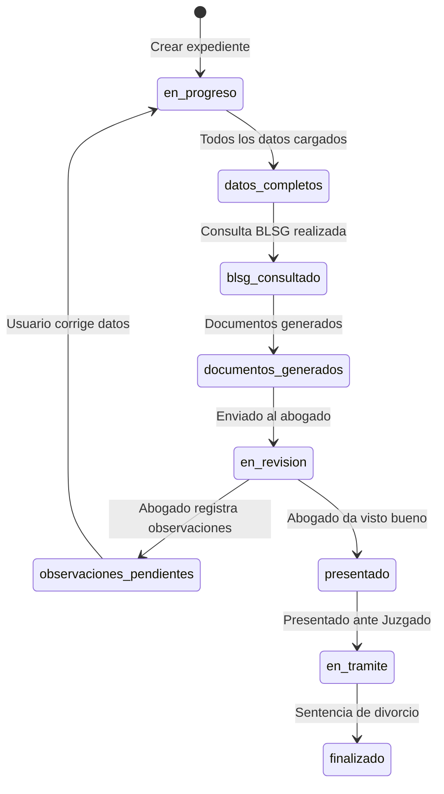
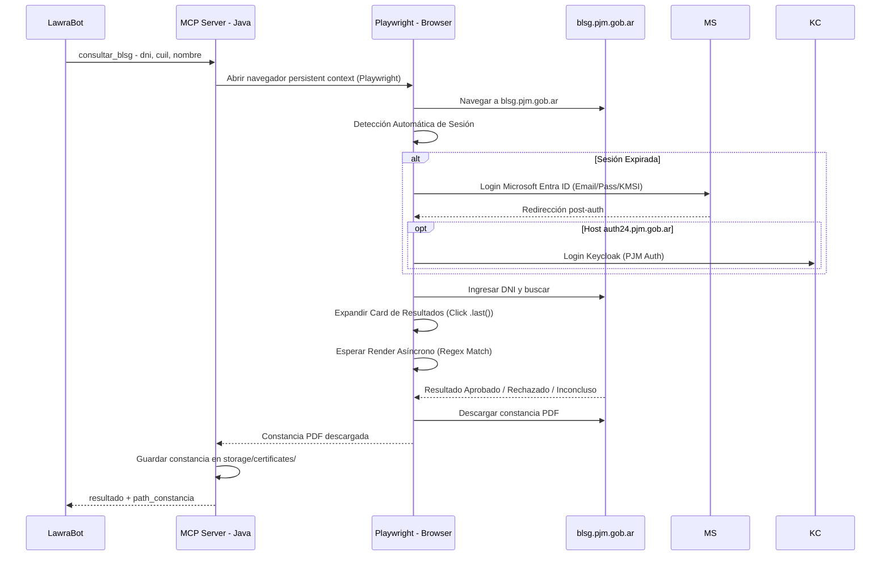

# TechSpecs — LawraBot: Especificaciones Técnicas

> **Estado:** Borrador v0.3 — En iteración  
> **Fecha:** 2026-03-24  
> **Depende de:** [PRD.md](./PRD.md)

---

## 1. Arquitectura General (Hub-and-Spoke)

LawraBot opera como un ecosistema modular donde un **Core Central** gestiona la identidad del ciudadano (MCI) y el aprendizaje (Learning Loop), mientras que el **Módulo de Divorcios** gestiona la lógica legal específica.



---

## 2. Stack Tecnológico

### 2.1 Agente Frontend (Canal WhatsApp)

| Componente | Tecnología | Versión | Propósito |
|---|---|---|---|
| Runtime | Node.js | 20+ LTS | Ejecución del agente |
| Lenguaje | TypeScript | 5.x | Tipado estricto |
| Framework del Agente | TemplateClaw (propio) | — | Orquestación de flujo conversacional |
| Canal de Mensajería | WhatsApp Multi-Device (Baileys) | latest | Comunicación con usuarios sin requerir API oficial |
| Cliente MCP | @modelcontextprotocol/sdk | latest | Consumo de herramientas del backend |
| Validación | Zod | latest | Validación de configuración |
| Logger | Pino | latest | Logs estructurados |

### 2.2 Backend Legal (Servidor MCP)

| Componente | Tecnología | Versión | Propósito |
|---|---|---|---|
| Framework | Spring Boot | 3.5.12 | Base del servidor |
| IA Framework | Spring AI | 1.1.3 | Integración con LLMs y RAG |
| Servidor MCP | spring-ai-starter-mcp-server-webmvc | (BOM) | Exposición de herramientas vía MCP |
| Proveedor LLM Chat | spring-ai-starter-model-openai | (BOM) | Bridge hacia Ollama Cloud |
| Embeddings (Local) | spring-ai-starter-model-transformers | (BOM) | Generación local de vectores (ONNX/HuggingFace) |
| Vector Store | spring-ai-starter-vector-store-pgvector | (BOM) | Almacenamiento persistente de vectores |
| ORM | Spring Data JPA + Hibernate | (Boot) | Persistencia de expedientes |
| Browser Automation | Playwright for Java | latest | Automatización de consulta BLSG (blsg.pjm.gob.ar) |
| PDF Processing | Apache PDFBox | latest | Extracción de texto y datos de PDFs recibidos |
| Email | Spring Boot Starter Mail | (Boot) | Envío de confirmaciones por email (Gmail SMTP) |
| Generación Documental | Apache POI / Docx4j | TBD | Generación de archivos .docx |
| Utilidades | Lombok | latest | Reducción de boilerplate |
| Java | OpenJDK | 21 | Runtime |

### 2.3 Centro de Operaciones (Admin Dashboard)

| Componente | Tecnología | Versión | Propósito |
|---|---|---|---|
| Framework | Next.js (App Router) | 14.x | Frontend del Centro de Control |
| Estilos | Tailwind CSS + v4 | latest | Diseño premium / Dark Mode |
| Animaciones | Framer Motion | latest | Feedback táctil y micro-interacciones |
| Iconos | Phosphor Icons | latest | Set iconográfico consistente |
| Cliente MCP | Custom SSE Hub | — | Conexión con servidores MCP |

### 2.4 Infraestructura

| Componente | Tecnología | Puerto | Propósito |
|---|---|---|---|
| Base de Datos | PostgreSQL 17 + PGVector | 5433 | Expedientes + Vector Store (Docker Map) |
| Caché/Sesiones | Redis Alpine | 6379 | Estado de conversaciones |
| Admin DB | Adminer | 8082 | UI para gestión de datos |
| Admin Redis | RedisInsight | 8001 | UI para inspección de sesiones |
| Orquestación | Docker Compose | — | Levantar infraestructura local |

### 2.4 LLM / Modelo de IA

| Componente | Tecnología | Propósito |
|---|---|---|
| Proveedor | Ollama Cloud | Inferencia en la nube |
| Endpoint | `https://ollama.com` | API compatible con OpenAI |
| Autenticación | Bearer Token (OLLAMA_CLOUD_API_KEY) | Seguridad de acceso |
| Modelo sugerido | gpt-oss:120b | Capacidad de razonamiento legal complejo |

### 2.5 Integraciones Externas

| Servicio | URL / Endpoint | Propósito | Tipo de acceso |
|---|---|---|---|
| Sistema BLSG - PJM | `https://blsg.pjm.gob.ar/` | Consulta automatizada del Beneficio de Litigar Sin Gastos | **Browser automation** (Playwright). El sistema es una SPA React/Vite sin API REST pública. |
| Gmail SMTP | `smtp.gmail.com:587` | Confirmación post-presentación al interesado | SMTP con TLS (App Password). Futuro: migración a SMTP institucional del MPD. |

---

## 3. Protocolo de Comunicación (MCP)

### 3.1 Transporte
- **Tipo:** HTTP / Server-Sent Events (SSE)
- **Modo:** Síncrono (`spring.ai.mcp.server.type=SYNC`)
- **Puerto del servidor MCP:** 8081

### 3.2 Herramientas (Tools) Planificadas

#### Gestión de Expediente

| Tool Name | Descripción | Parámetros de Entrada | Retorno |
|---|---|---|---|
| `crear_expediente` | Crea un expediente asociado a un teléfono | `telefono, tipo_divorcio (unilateral/conjunta)` | `id_expediente: String` |
| `obtener_estado_caso` | Devuelve el estado actual del expediente | `id_expediente` | `estado: String` |
| `obtener_datos_faltantes` | Devuelve qué información aún falta para generar docs | `id_expediente` | `List<String>` campos faltantes |

#### Recopilación de Datos

| Tool Name | Descripción | Parámetros de Entrada | Retorno |
|---|---|---|---|
| `registrar_datos_conyuge` | Guarda datos personales de un cónyuge | `id_expediente, numero_conyuge, nombre, dni, cuil, domicilio, fecha_nac, genero, profesion` | `OK / Error` |
| `registrar_datos_matrimonio` | Guarda datos del matrimonio | `id_expediente, fecha, lugar, numero_acta` | `OK / Error` |
| `registrar_datos_hijos` | Guarda datos de hijos menores | `id_expediente, nombre, fecha_nac, dni` | `OK / Error` |
| `registrar_acuerdos` | Guarda los acuerdos pactados (alimentos, bienes) | `id_expediente, tipo, descripcion` | `OK / Error` |
| `validar_jurisdiccion` | Verifica que el domicilio conyugal esté en San Rafael | `domicilio` | `boolean + mensaje` |

#### Documentación Digital (PDFs del Usuario)

| Tool Name | Descripción | Parámetros de Entrada | Retorno |
|---|---|---|---|
| `procesar_documento_pdf` | Recibe un PDF enviado por el usuario, extrae su contenido y lo asocia al expediente | `id_expediente, pdf_base64, tipo_documento` | `{campos_extraidos, texto_completo}` |
| `listar_documentos_expediente` | Lista todos los documentos digitales asociados a un expediente | `id_expediente` | `List<DocumentoDigital>` |

#### BLSG (Beneficio de Litigar Sin Gastos)

| Tool Name | Descripción | Parámetros de Entrada | Retorno |
|---|---|---|---|
| `consultar_blsg` | Automatiza navegador para consultar el sistema BLSG del PJM por DNI o nombre | `dni, cuil, nombre, apellido, fecha_nac, genero` | `{resultado: ACCEDE/NO_ACCEDE, url_constancia}` |
| `adjuntar_constancia_blsg` | Vincula la constancia PDF descargada al expediente | `id_expediente, constancia_pdf` | `OK / Error` |

#### Generación Documental

| Tool Name | Descripción | Parámetros de Entrada | Retorno |
|---|---|---|---|
| `generar_convenio` | Genera borrador del Convenio Regulador (.docx) | `id_expediente` | `url_descarga: String` |
| `generar_demanda` | Genera borrador de la Demanda de Divorcio (.docx) | `id_expediente` | `url_descarga: String` |

#### Orientación Legal (RAG)

| Tool Name | Descripción | Parámetros de Entrada | Retorno |
|---|---|---|---|
| `consultar_normativa` | RAG sobre el Código Civil (Familia/Divorcios) | `consulta: String` | `respuesta: String` |

#### Observaciones del Abogado

| Tool Name | Descripción | Parámetros de Entrada | Retorno |
|---|---|---|---|
| `registrar_observacion` | El abogado registra una observación sobre el expediente | `id_expediente, mensaje, campos_afectados` | `id_observacion: String` |
| `obtener_observaciones_pendientes` | Lista las observaciones no resueltas de un expediente | `id_expediente` | `List<Observacion>` |
| `resolver_observacion` | Marca una observación como resuelta tras la corrección del usuario | `id_observacion` | `OK / Error` |

#### Notificaciones

| Tool Name | Descripción | Parámetros de Entrada | Retorno |
|---|---|---|---|
| `enviar_confirmacion_email` | Envía email de confirmación post-presentación vía Gmail SMTP | `id_expediente, email_destinatario` | `OK / Error` |

### 3.3 Recursos (Resources) Planificados

| Resource URI | Descripción |
|---|---|
| `plantilla://convenio-regulador` | Plantilla base del Convenio Regulador |
| `plantilla://demanda-divorcio` | Plantilla base de la Demanda de Divorcio |
| `plantilla://ficha-blsg` | Plantilla de la ficha adjunta del BLSG |

### 3.4 Prompts Planificados

| Prompt Name | Descripción |
|---|---|
| `orientacion-legal` | Prompt para que el LLM responda preguntas legales de forma empática y con disclaimers |
| `extraccion-datos` | Prompt para que el LLM extraiga entidades (nombres, fechas, DNI) del texto libre del usuario |

---

## 4. Modelo de Datos (PostgreSQL)

### 4.1 Entidades de Identidad (MCI)

```mermaid
erDiagram
    CITIZEN {
        uuid id PK
        string dni UNIQUE
        string cuil
        string full_name
        string current_address
        timestamp updated_at
    }
    CASE_PARTICIPANT {
        uuid id PK
        uuid citizen_id FK
        uuid case_id FK
        string role "PETITIONER, RESPONDENT, HEIR, etc."
    }
    CITIZEN_INTERVENTION {
        uuid id PK
        uuid citizen_id FK
        string procedure_type
        string sensitivity_tier "GENERAL, RESTRICTED, HIGHLY_SENSITIVE"
        string summary_redacted
        text full_details_encrypted
    }
    CORRECTION_FEEDBACK {
        uuid id PK
        string field_name
        text original_text
        text ai_value
        text human_value
        timestamp expires_at
    }

    CITIZEN ||--o{ CASE_PARTICIPANT : participa
    CITIZEN ||--o{ CITIZEN_INTERVENTION : historia
    CASE_PARTICIPANT ||--o| EXPEDIENTE : vinculado
```

### 4.2 Estados del Expediente



---

## 5. Integración con Sistema BLSG

### 5.1 Flujo de Consulta



### 5.2 Datos Mínimos para la Consulta BLSG

| Campo | Obligatorio | Descripción |
|---|---|---|
| DNI | Sí | Documento Nacional de Identidad |
| CUIL | Sí | Clave Única de Identificación Laboral |
| Nombre y Apellido | Sí | Nombre completo del peticionante |
| Fecha de Nacimiento | Sí | Fecha de nacimiento del peticionante |
| Género | Sí | Género del peticionante |

### 5.3 Criterios de Evaluación del BLSG (Referencia)

El sistema BLSG evalúa basándose en datos del SINTyS. Criterios objetivos de denegatoria directa:
- Ingresos superiores a 8 salarios mínimos vitales y móviles.
- Titularidad de más de un inmueble.
- Titularidad de más de 2 vehículos con antigüedad menor a 7 años.
- Titularidad de embarcaciones o aeronaves.

---

## 6. Estructura de Carpetas del Proyecto

```
/lawrabot
├── /agent                         # Agente WhatsApp (Node.js/TypeScript)
│   ├── src/
│   ├── specs/                     # Especialización del agente
│   ├── package.json
│   └── tsconfig.json
│
├── /divorce_mcp_server            # Servidor MCP Legal (Java/Spring AI)
│   ├── src/main/java/com/lawrabot/divorce_mcp_server/
│   │   ├── application/           # Ports & UseCases (Hexagonal)
│   │   ├── domain/                # Modelos de Dominio & Value Objects
│   │   └── infrastructure/        # Adaptadores (JPA, REST, MCP)
│   │       ├── persistence/       # Mappers & Repositorios JPA
│   │       ├── rest/              # Controladores REST API (Dashboard)
│   │       └── mcp/               # Herramientas @McpTool
│   ├── src/main/resources/
│   │   ├── application.properties
│   │   └── templates/legal-templates/  # Plantillas .docx judiciales
│   └── pom.xml
│
├── .env                           # Variables de entorno (NO subir a Git)
├── docker-compose.yml             # PostgreSQL + Redis + Adminer + RedisInsight
├── mcp_config.json                # Orquestación MCP
├── PRD.md                         # Documento de Requisitos de Producto
├── TechSpecs.md                   # Especificaciones Técnicas (este archivo)
└── README.md
```

---

## 7. Seguridad

| Aspecto | Estrategia |
|---|---|
| **Secretos** | Variables de entorno en `.env` (nunca en código fuente ni en Git) |
| **Datos Sensibles (PII)** | Encriptación en reposo (PostgreSQL TDE o cifrado a nivel de campo). Logs sin datos personales. |
| **Autenticación LLM** | Bearer Token almacenado en `.env`, consumido vía `spring.ai.openai.api-key` |
| **Email (Gmail)** | App Password de Google almacenado en `.env`. No incluir la contraseña real de la cuenta. |
| **Comunicación MCP** | El servidor escucha en localhost (no expuesto a internet en MVP) |
| **Acceso BLSG** | A confirmar: credenciales del Poder Judicial o acceso público |
| **Archivos PDF** | Los PDFs del usuario se almacenan en filesystem local (MVP). Futuro: almacenamiento externo. |
| **Disclaimer Legal** | Inyectado automáticamente en el system prompt del agente |

---

## 8. Entorno de Desarrollo

### 8.1 Requisitos Previos
- Java 21 (OpenJDK)
- Node.js 20+ LTS
- Docker Desktop
- Maven (wrapper incluido: `mvnw`)
- Git

### 8.2 Comandos de Arranque

```bash
# 1. Levantar infraestructura
docker compose up -d

# 2. Arrancar el servidor MCP (Java)
cd divorce_mcp_server
./mvnw spring-boot:run

# 3. Arrancar el agente (Node.js)
cd agent
npm run dev -- --spec ./specs/divorce
```

---

## 9. Preguntas Técnicas Resueltas y Abiertas

### Resueltas

- [x] ~~¿El sistema BLSG expone una API REST?~~ → No. Es una SPA React/Vite. Se usará **Playwright for Java** para automatizar la consulta.
- [x] ~~¿Cómo integraremos WhatsApp sin la API oficial?~~ → Se usa **Baileys** para emular un cliente de WhatsApp Web (Multi-device), permitiendo ahorro de costos y mayor flexibilidad para el MVP.
- [x] ~~¿Qué servidor SMTP se usará?~~ → **Gmail SMTP** (`smtp.gmail.com:587`) con App Password. Futuro: migración a SMTP institucional.
- [x] ~~¿El bot procesa documentos digitales?~~ → Sí. Recibe y extrae contenido de **archivos PDF** usando Apache PDFBox.

### Abiertas

- [ ] ¿Qué librería usaremos para generar los .docx? (Apache POI vs. Docx4j vs. HTML-to-PDF)
- [ ] ¿Se requieren credenciales del Poder Judicial para acceder al sistema BLSG desde el servidor?
- [ ] ¿El RAG legal se cargará desde archivos PDF o desde una base de datos pre-curada?
- [ ] ¿Se necesita almacenamiento externo (S3/MinIO) para los archivos .docx y PDFs, o se almacenan en el filesystem del servidor?
- [ ] ¿Cómo ingresa el abogado sus observaciones al sistema? (¿WhatsApp dedicado, email, futuro dashboard?)

---

> **Próximo paso:** Iterar ambos documentos (PRD + TechSpecs) hasta v1.0, luego comenzar la implementación.
