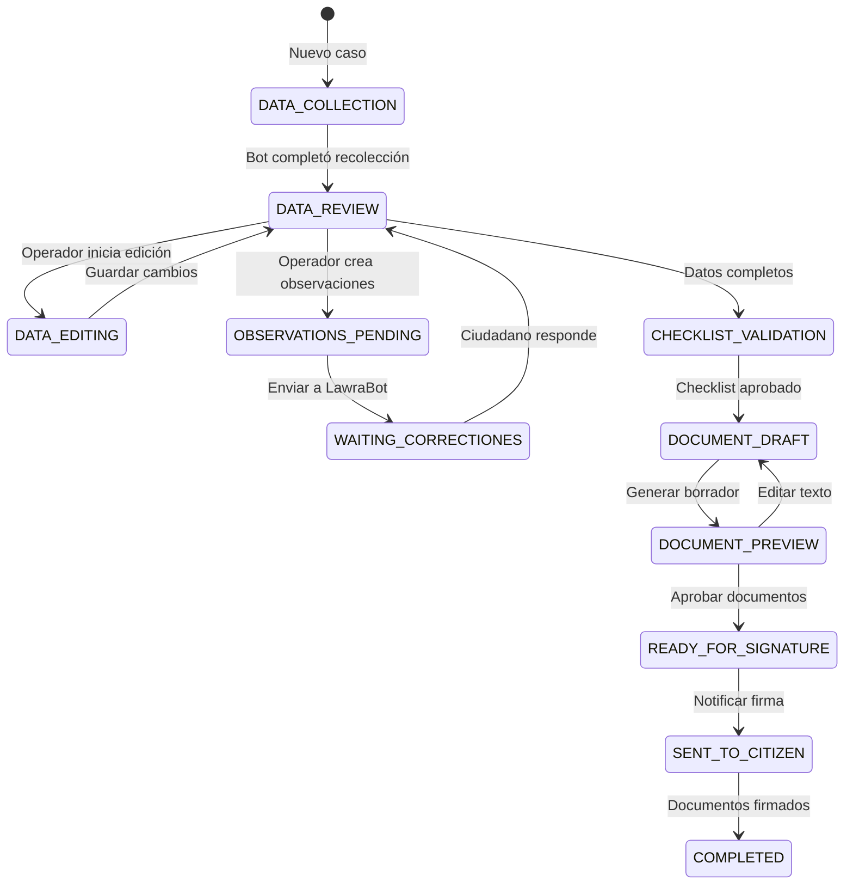

# Centro de Operaciones - Arquitectura Completa

## Visión General

Dashboard de operador humano con control total sobre expedientes de divorcio. El operador no contacta directamente al ciudadano; encarga tareas a LawraBot que ejecuta vía WhatsApp.

## Flujo de Comunicación

```
┌─────────────┐     ┌─────────────────┐     ┌──────────────┐     ┌─────────────┐
│   OPERADOR  │────▶│  DASHBOARD      │────▶│  MCP SERVER  │────▶│  LAWRA BOT   │
│  (Humano)   │     │  (Next.js)      │     │  (Java)      │     │  (Node.js)   │
└─────────────┘     └─────────────────┘     └──────────────┘     └─────────────┘
       │                      │                      │                   │
       │                      │                      │                   ▼
       │                      │                      │            ┌─────────────┐
       │                      │◄─────────────────────│◄───────────│  CIUDADANO   │
       │                      │   SSE/WebSocket      │   MCP      │ (WhatsApp)   │
       │                      │   (notificaciones)   │   Tools    └─────────────┘
       │                      │
       │◄─────────────────────│
       │   UI actualizada     │
       │   (React Query)      │
       └──────────────────────┘
```

## Estados del Expediente en Dashboard



## Estructura de Componentes

```
app/dashboard/divorce/
├── page.tsx                    # Página principal (CaseWorkspace)
├── components/
│   ├── CaseWorkspace.tsx       # Layout principal 3-paneles
│   ├── CaseListPanel.tsx       # Panel izquierdo: lista de casos
│   ├── CaseDetailPanel.tsx     # Panel central: detalle + edición
│   │   ├── sections/
│   │   │   ├── SpouseSection.tsx       # Datos cónyuges (editable)
│   │   │   ├── MarriageSection.tsx     # Datos matrimonio (editable)
│   │   │   ├── ChildrenSection.tsx     # Lista hijos (editable)
│   │   │   ├── SocioEconomicSection.tsx # Perfil económico (editable)
│   │   │   ├── AgreementRawSection.tsx  # Texto crudo convenio
│   │   │   └── AgreementStructured.tsx  # Formulario estructurado convenio
│   ├── CaseActionsPanel.tsx    # Panel derecho: acciones + checklist
│   │   ├── ChecklistCard.tsx   # Lista validación obligatoria
│   │   ├── DocumentActions.tsx # Generar/Previsualizar documentos
│   │   └── ObservationComposer.tsx # Crear observaciones
│   ├── DocumentPreviewModal.tsx # Modal previsualización PDF/DOCX
│   └── HitlChatPanel.tsx       # Panel conversación HITL
│       ├── MessageBubble.tsx
│       ├── TaskComposer.tsx    # Componer tareas para LawraBot
│       └── InterventionToggle.tsx # Toggle modo intervención
```

## Endpoints API Requeridos (MCP Server)

### Gestión de Casos
```
GET    /api/divorce/cases                    # Lista con filtros
GET    /api/divorce/cases/:id                # Detalle completo
PUT    /api/divorce/cases/:id                # Actualizar datos
POST   /api/divorce/cases/:id/observations   # Crear observación
GET    /api/divorce/cases/:id/observations   # Listar observaciones
PUT    /api/divorce/cases/:id/status         # Cambiar estado
```

### Gestión de Observaciones → Tareas
```
POST   /api/divorce/observations              # Crear observación
{
  "expedienteId": "uuid",
  "field": "alimonyAmount",
  "severity": "ERROR|WARNING|INFO",
  "message": "La cuota de $200 parece un error de tipeo",
  "suggestedValue": "50000",
  "createTask": true
}

GET    /api/divorce/cases/:id/pending-tasks   # Tareas pendientes
POST   /api/divorce/tasks/:id/assign          # Asignar a LawraBot
{
  "assignedTo": "LAWRA_BOT",
  "messageTemplate": "Hemos detectado un posible error..."
}
```

### Control HITL (Human-in-the-Loop)
```
GET    /api/divorce/cases/:id/conversation    # Historial WhatsApp
POST   /api/divorce/cases/:id/intervene       # Enviar como LawraBot
{
  "message": "Mensaje personalizado",
  "asLawraBot": true,
  "requiresResponse": true
}

POST   /api/divorce/cases/:id/hitl-mode      # Activar/desactivar HITL
{
  "enabled": true,
  "operatorId": "uuid",
  "reason": "Corrección de datos"
}
```

### Generación Documental
```
POST   /api/divorce/cases/:id/generate-draft  # Generar borrador
{
  "documentType": "DEMAND|CONVENIO|OFICIO",
  "format": "PDF|DOCX",
  "templateId": "default|custom"
}

GET    /api/divorce/cases/:id/preview/:docId # Previsualizar
POST   /api/divorce/cases/:id/finalize        # Marcar como final
```

### Checklist de Validación
```
GET    /api/divorce/cases/:id/checklist       # Obtener checklist
PUT    /api/divorce/cases/:id/checklist      # Actualizar ítems
{
  "items": [
    {"id": "petitioner_data", "status": "VALIDATED", "operatorId": "uuid"},
    {"id": "spouse_data", "status": "VALIDATED", "operatorId": "uuid"},
    {"id": "marriage_data", "status": "PENDING", "notes": "Fecha separación aproximada"}
  ]
}
```

## Sistema de Observaciones → Tareas

### Modelo de Observación
```typescript
interface Observation {
  id: string;
  expedienteId: string;
  field: string;           // Campo afectado
  severity: 'ERROR' | 'WARNING' | 'INFO';
  message: string;         // Descripción del problema
  suggestedValue?: string; // Valor sugerido
  status: 'PENDING' | 'ASSIGNED_TO_BOT' | 'RESOLVED' | 'DISMISSED';
  createdBy: string;       // Operador
  createdAt: Date;
  resolvedAt?: Date;
  resolution?: string;
}
```

### Flujo de Observación
```
1. Operador detecta problema (ej: cuota alimentaria $200)
2. Crea observación con severity=ERROR
3. Sistema genera tarea automáticamente
4. Tarea aparece en cola de LawraBot
5. LawraBot envía mensaje al ciudadano vía WhatsApp
6. Ciudadano responde
7. LawraBot actualiza datos
8. Operador ve resolución en dashboard
9. Operador valida y marca como RESOLVED
```

## Checklist de Validación Obligatoria

### Items Base
```typescript
const CHECKLIST_ITEMS = [
  { id: 'petitioner_data', label: 'Datos del peticionante', required: true },
  { id: 'spouse_data', label: 'Datos del demandado', required: true },
  { id: 'marriage_data', label: 'Datos del matrimonio', required: true },
  { id: 'children_data', label: 'Datos de hijos (si aplica)', required: false },
  { id: 'socioeconomic_data', label: 'Perfil socioeconómico', required: true },
  { id: 'agreement_raw', label: 'Convenio (texto crudo)', required: true },
  { id: 'agreement_structured', label: 'Convenio (estructurado)', required: true },
  { id: 'blsg_verified', label: 'BLSG verificado', required: true },
  { id: 'observations_resolved', label: 'Observaciones resueltas', required: true },
  { id: 'documents_reviewed', label: 'Documentos revisados', required: true }
];
```

### Reglas
- Todos los items `required: true` deben estar en `VALIDATED` para generar documentos
- El operador puede agregar notas a cada ítem
- Items opcionales pueden marcarse como `NOT_APPLICABLE`

## Control HITL (Human-in-the-Loop)

### Modos de Operación

#### Modo Observación (Default)
- Operador ve conversación en tiempo real
- No puede intervenir
- Solo crear observaciones

#### Modo Intervención
```typescript
interface HitlSession {
  id: string;
  expedienteId: string;
  operatorId: string;
  mode: 'OBSERVATION' | 'INTERVENTION';
  startedAt: Date;
  endedAt?: Date;
  reason: string;
}
```

- Operador toma control de la conversación
- Mensajes se envían como "LawraBot" (con marca de operador interna)
- LawraBot pausa respuestas automáticas
- Ciudadano no sabe que es un humano (transparencia ética: disclosure opcional)

### Composer de Tareas
```typescript
interface TaskTemplate {
  id: string;
  name: string;
  description: string;
  messageTemplate: string;
  variables: string[];
  example: string;
}

const TASK_TEMPLATES = [
  {
    id: 'clarify_data',
    name: 'Aclarar dato',
    description: 'Solicitar aclaración sobre información confusa',
    messageTemplate: 'Necesito aclarar un dato: {{field}}. {{question}}',
    variables: ['field', 'question']
  },
  {
    id: 'request_document',
    name: 'Solicitar documento',
    description: 'Pedir envío de documentación faltante',
    messageTemplate: 'Para continuar necesito que me envíe: {{document}}. {{instructions}}',
    variables: ['document', 'instructions']
  },
  {
    id: 'notify_appointment',
    name: 'Notificar cita',
    description: 'Convocar a firma de documentos',
    messageTemplate: 'Sus documentos están listos. Por favor concurra a {{location}} el {{date}} a {{time}} para firmar.',
    variables: ['location', 'date', 'time']
  },
  {
    id: 'correct_error',
    name: 'Corregir error',
    description: 'Notificar error detectado',
    messageTemplate: 'Detectamos un posible error en {{field}}: {{error}}. El valor correcto debería ser aproximadamente {{suggested}}. ¿Puede confirmar?',
    variables: ['field', 'error', 'suggested']
  }
];
```

## Datos Editable por Operador

### Sección Cónyuges (SpouseSection)
- Nombre completo (firstName, lastName)
- DNI, CUIL
- Fecha nacimiento
- Domicilio completo (calle, número, piso, localidad, provincia, CP)
- Nacionalidad
- Profesión/Oficio
- Email, Teléfono

### Sección Matrimonio (MarriageSection)
- Fecha celebración (día exacto)
- Lugar celebración
- Fecha separación (día exacto)
- Último domicilio conyugal

### Sección Hijos (ChildrenSection)
- Lista editable (agregar/quitar)
- Nombre completo
- Fecha nacimiento
- DNI
- Flag discapacidad

### Sección Convenio Estructurado (AgreementStructured)

#### Alimentos
- Tipo provisión (fija/porcentaje/parámetros legales)
- Monto y moneda
- Frecuencia pago
- Método pago (transferencia/deposito/efectivo)
- Detalles método
- Mecanismo actualización

#### Cuidado Personal
- Tipo (compartido/exclusivo madre/exclusivo padre)
- Variante compartida (alternada/semestral/por periodos)
- Residencia principal

#### Régimen Comunicacional
- Tipo (libre/fijado/mixto/supervisado)
- Detalle horarios específicos
- Lugar retiro
- Supervisor (si aplica)

#### Distribución Bienes
- Atribución vivienda (quién se queda/queda libre)
- Plazo desalojo (si aplica)
- Resumen bienes
- Resumen deudas

#### Compensación Económica
- Aplica/no aplica
- Justificación desequilibrio
- Beneficiario
- Forma pago (única/cuotas)
- Monto/plazo

## Previsualización de Documentos

### Flujo
```
1. Operador hace clic en "Previsualizar"
2. Backend genera PDF temporal (marca "BORRADOR")
3. Modal se abre con visor PDF embebido
4. Operador puede:
   - Descargar para revisión externa
   - Editar datos y regenerar
   - Aprobar para generación final
5. Documento final se marca como "APROBADO"
```

### Componentes
```typescript
interface DocumentPreviewProps {
  documentId: string;
  documentType: 'DEMAND' | 'CONVENIO' | 'OFICIO' | 'BLSG';
  format: 'PDF' | 'DOCX';
  status: 'DRAFT' | 'APPROVED' | 'FINAL';
  downloadUrl: string;
  onApprove: () => void;
  onRegenerate: () => void;
  onDownload: () => void;
}
```

## Integración Tiempo Real

### WebSocket Events
```typescript
// Server → Client
interface DashboardEvent {
  type: 'CASE_UPDATED' | 'NEW_MESSAGE' | 'OBSERVATION_RESOLVED' | 'TASK_COMPLETED';
  expedienteId: string;
  payload: unknown;
  timestamp: Date;
}

// Client → Server
interface OperatorAction {
  type: 'EDIT_DATA' | 'CREATE_OBSERVATION' | 'SEND_HITL_MESSAGE' | 'UPDATE_CHECKLIST';
  expedienteId: string;
  payload: unknown;
  operatorId: string;
}
```

## Permisos y Roles

### Operador Defensoría
- Ver todos los casos
- Editar todos los datos
- Crear observaciones
- Enviar tareas a LawraBot
- Modo HITL intervención
- Generar documentos
- Checklist validation

### Operador Supervisor
- Todo lo anterior +
- Reasignar casos
- Ver métricas/analíticas
- Configurar templates

## Estados de Checklist

```typescript
type ChecklistStatus = 
  | 'PENDING'        // No revisado aún
  | 'IN_REVIEW'      // Operador está revisando
  | 'VALIDATED'      // Operador validó
  | 'HAS_ISSUES'     // Operador encontró problemas (crea observación)
  | 'NOT_APPLICABLE' // No aplica a este caso
  | 'AUTO_FILLED';   // Completado automáticamente por bot
```

## UI/UX Consideraciones

### Layout 3-Paneles
```
┌─────────────────────────────────────────────────────────────────────────────┐
│  HEADER: Búsqueda + Notificaciones + Nuevo Caso                             │
├──────────────┬──────────────────────────────────────────┬───────────────────┤
│              │                                          │                   │
│  PANEL 1     │         PANEL 2                          │     PANEL 3       │
│  Lista Casos │         Detalle del Caso                 │     Acciones      │
│              │         (Tabs: Datos/Convenio/Chat)      │     + Checklist   │
│              │                                          │                   │
│  [Filtros]   │  ┌──────────────────────────────────┐   │  [Checklist]      │
│  [Buscar]    │  │ Sección editable (Spouse/etc)    │   │  [Generar Docs]   │
│              │  │                                  │   │  [Observaciones]  │
│  CaseCard    │  │ Formulario inline                │   │  [Chat HITL]      │
│  CaseCard    │  │                                  │   │                   │
│  CaseCard    │  │ [Guardar] [Cancelar]             │   │                   │
│              │  └──────────────────────────────────┘   │                   │
│              │                                          │                   │
│              │  ┌──────────────────────────────────┐   │                   │
│              │  │ Convenio Raw vs Estructurado     │   │                   │
│              │  │ (Split view)                     │   │                   │
│              │  │                                  │   │                   │
│              │  │ Raw: "el menor vivira con la      │   │                   │
│              │  │       madre..."                    │   │                   │
│              │  │                                  │   │                   │
│              │  │ Estructurado:                      │   │                   │
│              │  │ [Tenencia: Madre ▼]              │   │                   │
│              │  │ [Cuota: $50000 ▼]                  │   │                   │
│              │  └──────────────────────────────────┘   │                   │
│              │                                          │                   │
├──────────────┴──────────────────────────────────────────┴───────────────────┤
│  FOOTER: Estado conexión MCP | Versión | Usuario logueado                  │
└─────────────────────────────────────────────────────────────────────────────┘
```

## Notas de Implementación

1. **Optimistic UI**: Las ediciones del operador se reflejan inmediatamente en UI mientras se sincroniza con backend

2. **Conflict Resolution**: Si LawraBot actualiza datos mientras operador edita, mostrar warning de "Datos actualizados externos"

3. **Audit Trail**: Todo cambio del operador se loguea con timestamp y operatorId

4. **Auto-save**: Draft de ediciones cada 30 segundos en localStorage

5. **Keyboard Shortcuts**:
   - `Ctrl+S`: Guardar cambios
   - `Ctrl+Enter`: Enviar mensaje HITL
   - `Esc`: Cancelar edición actual
   - `F5`: Forzar refresco de datos
